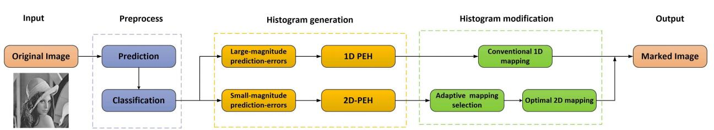
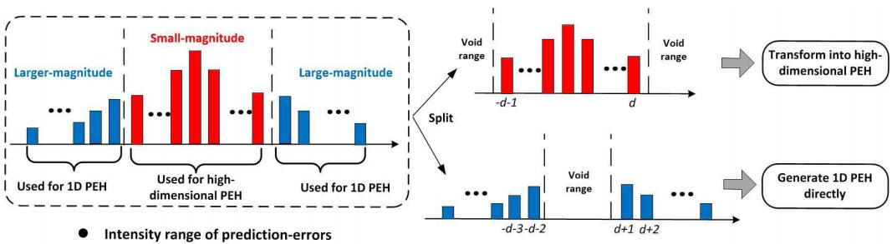
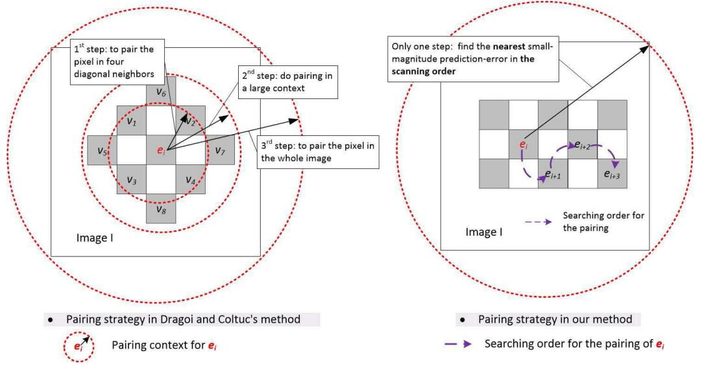
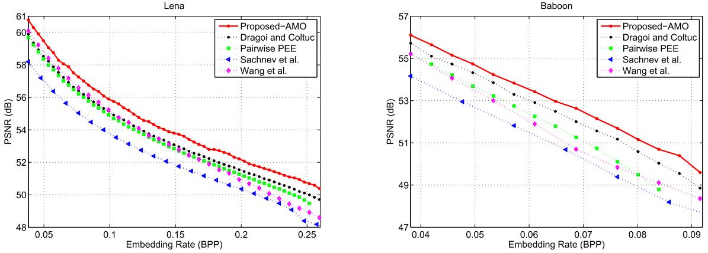
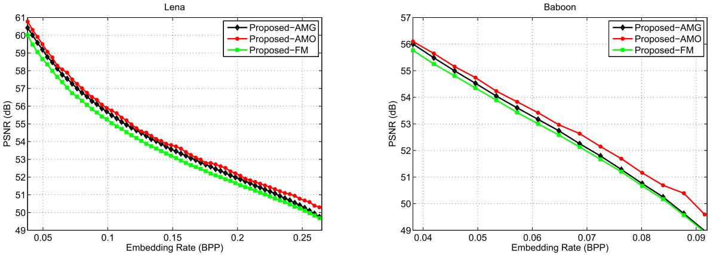
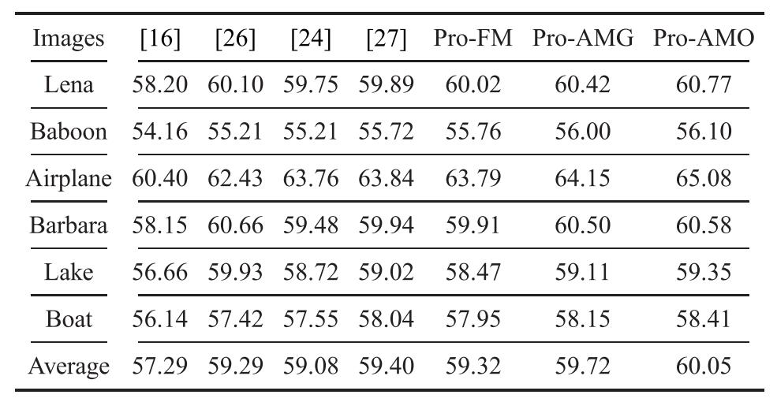
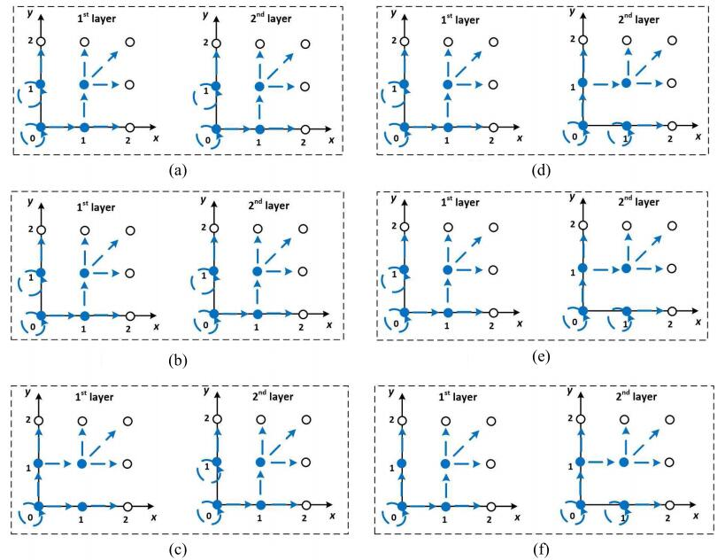

Hybrid pairwise PEE
=======


论文题目： "[Improving Pairwise PEE via Hybrid-Dimensional Histogram Generation and  Adaptive Mapping Selection](https://ieeexplore.ieee.org/document/8419757)" (TCSVT 2019).


<p align="center">     </p>
<p align="center"> 图1: 方法流程图 </p>


<p align="center">     </p>
<p align="center"> 图2: 混合PEH修改的基本框架. </p>

<p align="center">     </p>
<p align="center"> 图3: 自适应配对策略对比. </p>

## 如何运行

```
进入 Public_Code 文件夹
运行 mian.m 文件
```

## 实验结果

<p align="center">     </p>
<p align="center"> 图4: 对比容量-失真性能 </p>

<p align="center">     </p>
<p align="center"> 图5: 3种映射策略的性能对比.</p>

<p align="center">     </p>
<p align="center"> 图6: PSNR对比.</p>

<p align="center">     </p>
<p align="center"> 图7: 使用Pro-AMG算法生成的最优2D映射. </p>


## 实验环境
Matlab 2016b <br>


## 致谢
本研究得到了国家重点研发计划（2016YFB0800404）的部分资助，国家科学基金（61502160、61572052、U1736213、61332012）的部分资助和中央高校基本科研业务费（2017RC008）的部分资助。


## 引用格式
如果这项工作对您的研究有帮助, 请按如下格式引用：
```
@ARTICLE{8419757,
  author={Ou, Bo and Li, Xiaolong and Zhang, Weiming and Zhao, Yao},
  journal={IEEE Transactions on Circuits and Systems for Video Technology}, 
  title={Improving Pairwise PEE via Hybrid-Dimensional Histogram Generation and Adaptive Mapping Selection}, 
  year={2019},
  volume={29},
  number={7},
  pages={2176-2190},
  doi={10.1109/TCSVT.2018.2859792}}
```

## 版权声明
受欧博老师委托，本项目已开源 (详见 ``` MIT LICENSE ``` ).
